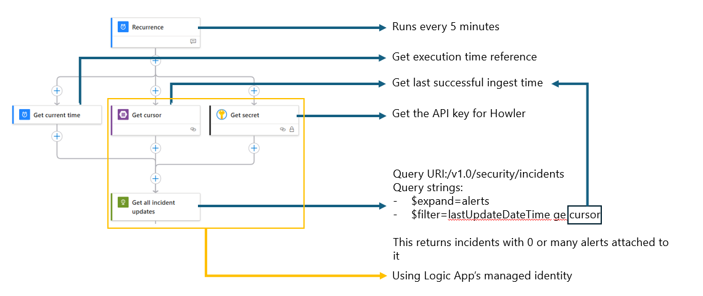
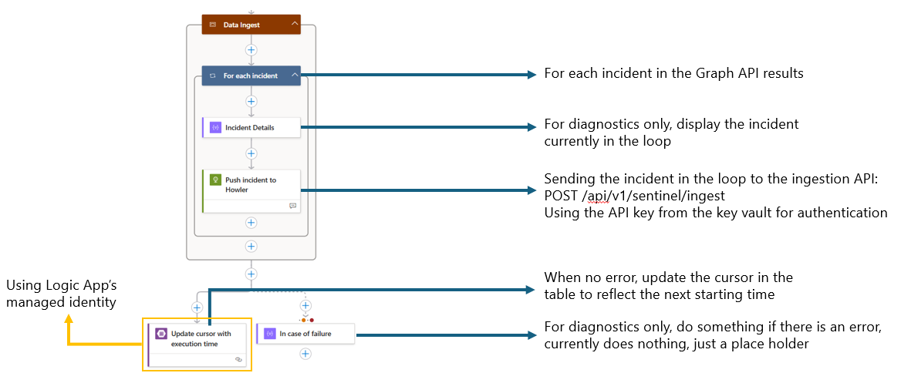

## Send Defender incidents to Howler

The Howler integration uses the Graph API [incident endpoint](https://learn.microsoft.com/en-us/graph/api/security-list-incidents?view=graph-rest-1.0&tabs=http) to pull incidents from Defender and send them to the ingestion URI of your Howler deployment. When using Sentinel, ensure that Sentinel is integrated with Defender to achieve full incident synchronization coverage.

🔗 [https://learn.microsoft.com/en-us/unified-secops-platform/microsoft-sentinel-onboard](https://learn.microsoft.com/en-us/unified-secops-platform/microsoft-sentinel-onboard)

Here are the installation steps:
- Deploy the resources in Azure:   
   
A Bicep file is also available for manual deployment: 💪 [Deploy the solution](https://raw.githubusercontent.com/piaudonn/DefenderForHowler/refs/heads/main/deploy/FromDefenderToHowler.bicep)
- During the deployment, you will be asked for the following informations:
   - A resource group where the Logic App, the Storage Account and the Key Vault will be deployed
   - An Azure region for your deployment
   - The name of the Log App
   - The name of the Key Vault
   - The API Key for Howler ingestion (ask your Howler admin for the key)
   - The API URI for Howler ingestion (ask your Howler admin for the URI)
   - The name of the Storage Account
   - The name of the table where the cursor will be stored
   - An interval in minutes for the recurrence trigger (it is recommended to leave at 5 minutes)
 - Execute the [Grant-APIPermissions.ps1](https://raw.githubusercontent.com/piaudonn/DefenderForHowler/refs/heads/main/deploy/Grant-APIPermissions.ps1) to grant your Log App managed identity the permissions `SecurityAlert.Read.All` and `SecurityIncident.Read.All` on the Graph API.
 

### Logic App with recurrence trigger 

A consumption-based Logic App is used to pull Defender incidents every 5 minutes and send them to the ingestion API you defined during installation.

It is possible that the same alerts and incidents may be sent to Howler more than once. However, Howler includes a disambiguation mechanism to handle duplicates. The Logic App itself is agnostic of this logic.