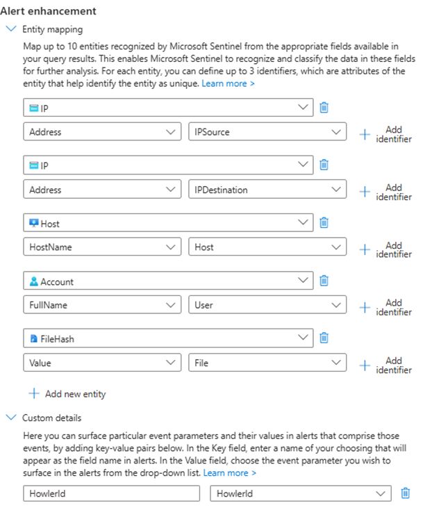
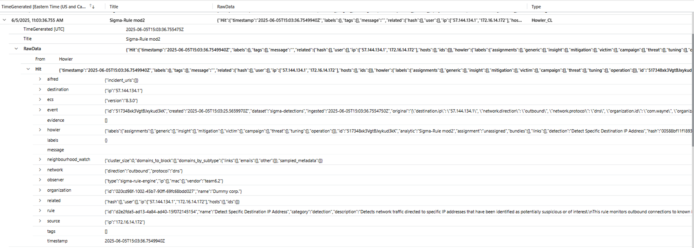

## Send Howler hits to Defender 

If Howler is configured with the appropriate tenant identifier and has a service principal with the target tenant, an operator could promote a hit to an alert in Holwer and have this create a new ncident in Defender.

The solution is composed of:
- A custom table with a very basic schema
- A data collection rule to define how the data flows to the custom table (no need of a custom endpoint unless you want to use Azure private networking)
- A near real time analytic rule to trigger an incident as soon as new data  is available in the custom table

Here are the installation steps:
- Deploy the resources in Azure:   
[](https://portal.azure.com/#create/Microsoft.Template/uri/https://raw.githubusercontent.com/piaudonn/DefenderForHowler/refs/heads/main/deploy/FromHowlerToDefender_main.json)   
A Bicep file is also available for manual deployment: 💪 [Deploy the solution](https://raw.githubusercontent.com/piaudonn/DefenderForHowler/refs/heads/main/deploy/FromHowlerToDefender_main.bicep)
- During the deployment, you will be asked for the following informations:
   - A resource group where the Data Collection Rule will be created
   - The full resource identifier of the log analytics workspace used by Sentinel
   - The workspace identifier of the aforementionned log analytics workspae
   - The name of the custom table (it needs to finish with `_CL`)
   - The name of the near realtime analytics rule it will create to trigger incident from hit

### Data Collection Rule

There is no API to create an incident in the Graph API. Instead, we ingest custom data in the Sentinel workspace and we trigger incident on that data. To allow ingestion, a Data Collection Rule of the kind `Direct` is created (it gives us an API endpoint to use). To retrieve the ingestion endpoint, you can look at the json details of the Data Collection Rule in the Azure portal.

Howler also uses a service principal in the destination tenant with the RBAC role *Monitoring Metrics Publisher* to be allowed to send data.

### Near realtime analytic rule

NRT rules do not run on a schedule, instead they will trigger an incident as soon as the KQL query returns a result.
The rule also map Howler’s evidences to Sentinel’s entities.

```kql
Howler_CL
| extend HowlerId = RawData.Hit.howler.id
| where isnotempty(HowlerId)
| extend Severity = toint(RawData.Hit.event.severity)
| extend Severity = case( Severity in (75,50), "High", Severity == 25, "Medium", Severity == 10, "Low", "Informational")
| extend IPSource = RawData.Hit.source.ip
| extend IPDestination = RawData.Hit.destination.ip
| extend User = RawData.Hit.related.user[0]
| extend Host = RawData.Hit.related.hosts[0]
| extend File = RawData.Hit.related.hash[0]
| extend Description = RawData.Hit.rule.description
| extend Source = "Howler"
```
As of today, the following entity mapping is configured:




### Custom table

The custom table schema is the following:

| Column Name | Type |
|-|-|
|TimeGenerated|datetime|
|Title|string|
|RawData|dynamic|

Example:

