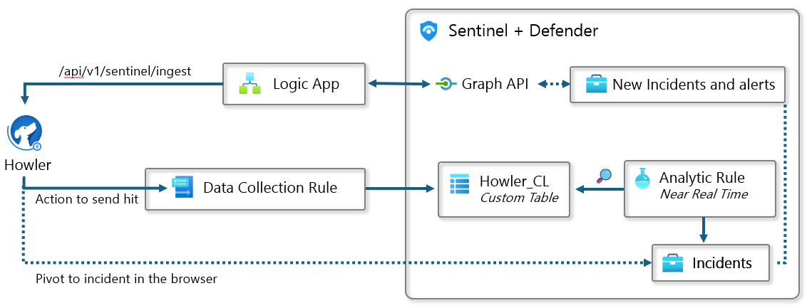

## Howler and Defender integration

This repository contains the resources to integrate the Defender platform (including Microsoft Sentinel) with the open-source platform Howler.

### Send Defender incidents to Howler

This synchronization is achieved through a Logic App that reads incidents created or modified in Defender and sends them to Howler.

By default, this sync runs every 5 minutes. To keep track of the last synchronization, a storage account table is used to store a cursor. This cursor can also be used to artificially set a starting point for synchronization.

The solution deploys the following resources:
- A consumption Logic App which runs every 5 minutes using its system managed identity
- A Storage Account to store the cursor in a table
- A Keyvault to store the secret for Howler ingestion API

It also grants the necessary permissions to the system managed identity the permission to read and modify the table as well as read the secret. 

🦉 Details and deployment steps are available here: [Send Defender incidents to Howler](FromDefenderToHowler.md)

### Send Howler hits to Defender (Sentinel ingestion)

It is possible to configure Howler to send hits to Defender through custom log ingestion in the Log Analytics workspace used by Sentinel. To enable this, a Data Collection Rule (DCR) is created in Azure Monitor that maps incoming data to a custom table in Log Analytics. Then, a near real-time analytics rule in Sentinel is configured to create an incident as soon as data arrives in this table.

The solution deploys a Data Collection Rule, a custom Log Analytics table, and an analytics rule in Sentinel. You will need to provide the Log Analytics workspace used by Sentinel, as well as the service principal that you have configured on the Howler side of the integration.

🦉 Details and deployment steps are available here: [Send Howler hits to Defender](FromHowlerToDefender.md)

